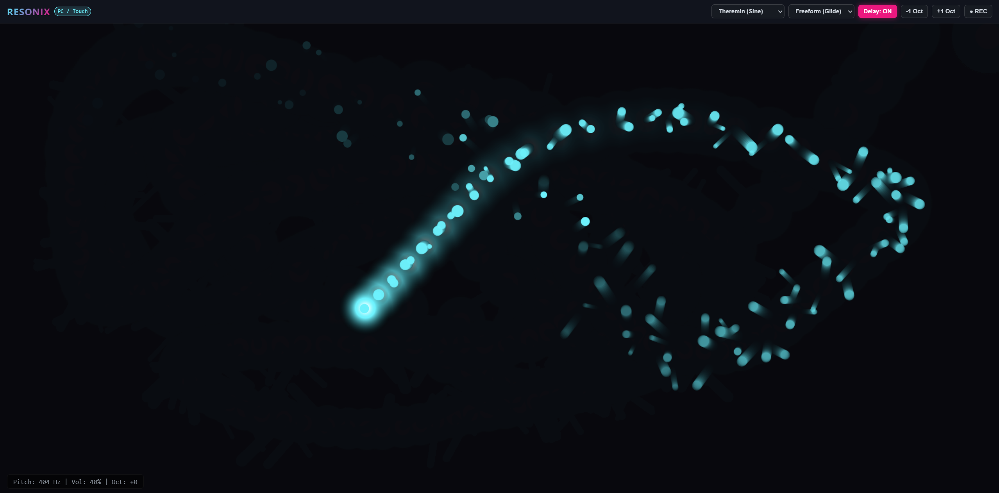
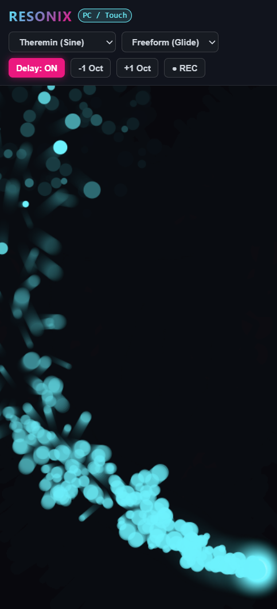

# Resonix

> **Play music out of thin air.** An expressive, browser-based motion synthesizer inspired by the legendary Moog Etherwave Theremin.

Resonix turns your phone's gyroscope or your computer mouse into an expressive musical instrument. Tilt your phone to glide through octaves, shape dynamic swells, and play melodies instantly—no instruments, cables, or hardware setup required.

[](https://simone2048.github.io/Resonix/)
[](https://github.com/Simone2048/Resonix)

---

## Screenshots

<p align="center">
  
  &nbsp;&nbsp;&nbsp;&nbsp;
  
</p>
<p align="center">
  <em>Desktop Interface (Left) &nbsp;|&nbsp; Mobile Performance Mode (Right)</em>
</p>

---

## Demo Video

<p align="center">
  <a href="Screenshots/demo_1.mp4">
    
  </a>
  <br>
  <sub>▶️ <strong>Click the image above to watch the video demo (demo_1.mp4)</strong></sub>
</p>

---
## How to Play

You don't need music theory or years of violin training to get started. Just open the link, move around, and listen.

### On Your Phone (Gyroscope Mode)
*Best experienced on mobile with headphones!*

* **Pitch (Tilt Left / Right):** Tilt your phone horizontally to glide across pitches from low notes to soaring highs.
* **Volume (Tilt Toward / Away):** Tilt the top of the phone toward you to swell the volume; lay it flat to silence.
* **Play Offline (PWA):** Tap your browser's share menu and pick **"Add to Home Screen"** to install Resonix as a standalone, offline app with zero lag.

---

### On Your Laptop / Desktop (Mouse Mode)

* **Horizontal (X-Axis):** Move your cursor left-to-right to control the pitch frequency (spanning C3 ~130 Hz up to C6 ~880 Hz).
* **Vertical (Y-Axis):** Move your cursor up and down to open up volume and filter brightness.

---

## Features

### 4 Built-In Sound Engines
* **Theremin:** Pure, ghostly sine wave with subtle vintage warmth.
* **Analog Lead:** Bright, rich sawtooth wave that cuts through with classic 80s synth character.
* **8-Bit Arcade:** Nostalgic square wave built for chiptunes and retro game soundtracks.
* **Warm Sub:** Soft triangle wave focused on deep, vibrating low-end basslines.

### Space Echo Delay
An integrated stereo feedback loop with a rhythmic 280ms delay buffer and 40% decay. Adds huge, dreamy space to every note you slide into.

### Reactive Particle Canvas
A glowing, hardware-accelerated 2D visualizer that reacts to your playing style in real time—surging when you swell volume and dancing faster as your pitch jumps.

### Built-In Audio Recorder
Capture your improvisation on the fly. Record your performance directly through the Web Audio stream and export it instantly as a high-quality `.webm` audio file.

---

## Built With

* **Vanilla Web Audio API** – Zero-latency audio synthesis directly in the browser engine.
* **HTML5 Canvas (2D Context)** – Lightweight, 60 FPS reactive particle visualizer.
* **DeviceOrientation API** – Precise mobile gyroscope tracking.
* **Service Workers & PWA Manifest** – Fully functional offline without an internet connection.

---

## Quick Run (Local Setup)

Want to tweak the synth engine or run it locally?

1. **Clone the repository:**
   ```bash
   git clone https://github.com/Simone2048/Resonix.git
   cd Resonix
